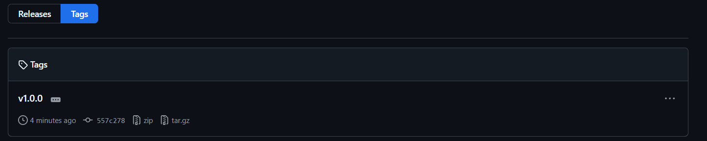
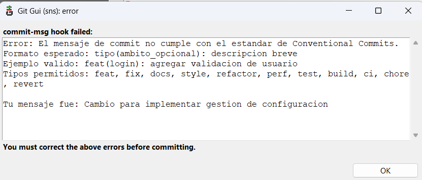
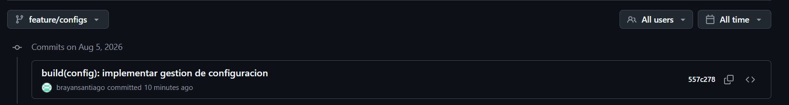
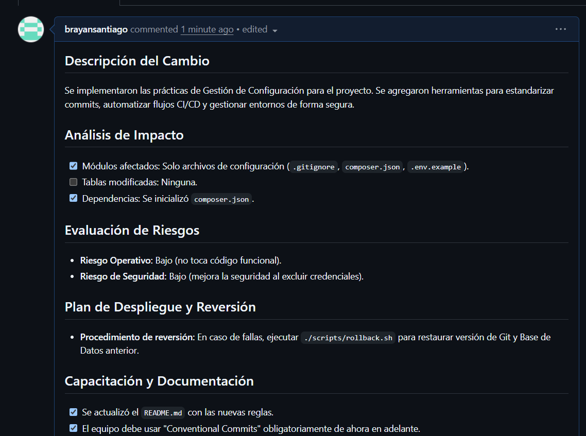

- Brayan Santiago Chaparro
- Manuel Alejandro Ovalle

# Gestion de Configuración

A continuacion se documentan las estrategias, politicas y automatizaciones aplicadas sobre la versión inicial.

## 1. Estrategia de Versionamiento (GitFlow)
El repositorio utiliza GitFlow como estrategia de ramificacion, definiendo los siguientes flujos de trabajo:
- **main**: Rama de produccion que contiene el codigo estable. Solo acepta fusiones provenientes de `release` o `hotfix`.
- **develop**: Rama de integracion principal. Todas las nuevas caracteristicas se unen aqui.
- **feature/*** : Ramas temporales creadas a partir de `develop` para desarrollar nuevas funcionalidades.
- **release/*** : Ramas para la preparacion de un pase a produccion.
- **hotfix/*** : Ramas para solucionar errores criticos en produccion de forma inmediata.

## 2. Versionamiento Semantico
Se adopta el estandar de versionamiento semantico (MAYOR.MENOR.PARCHE):
- MAYOR: Cambios arquitectonicos o incompatibilidades hacia atras.
- MENOR: Nuevas funcionalidades compatibles.
- PARCHE: Correccion de errores sin alteracion del uso general.
Los lanzamientos se etiquetan utilizando Git Tags (ej. `v1.2.0`).

 

 

## 3. Buenas Practicas de Commits
Se emplea el estandar de Conventional Commits para asegurar un historial limpio y legible. Para esto, se implemento un hook de Git (`.git/hooks/commit-msg`) que intercepta el texto del commit y valida automaticamente que comience con un tipo valido (feat, fix, docs, etc). Ejemplos de uso correcto:
- `feat(auth): agregar inicio de sesion`
- `fix(inventario): corregir calculo de existencias`
- `docs(readme): actualizar documentacion`

**Ejemplo commit - Validacion Fallida:**
A continuacion se muestra un ejemplo de lo que ocurre si un desarrollador intenta registrar un mensaje incorrecto. En el siguiente caso, se intento guardar un commit escribiendo el siguiente mensaje (`git commit -m "Ajuste..."`) por ejemplo desde Git GUI. 
Como la cadena de texto iniciaba con "Ajuste" y no con un formato semantico valido, el Hook local cancelo inmediatamente la transaccion y le mostro las instrucciones correctas, previniendo que el repositorio quede manchado con historiales ilegibles.

 

 

**Ejemplo commit correcto:**

 

 

## 4. Gestion de Dependencias y Ambientes
- **Dependencias**: Se incorporo un gestor de paquetes (`composer.json`) para mantener versiones exactas de librerias externas, evitando asi problemas de indisponibilidad.
- **Ambientes**: El sistema maneja el mismo codigo base para los entornos de Desarrollo, Pruebas y Produccion, aislando unicamente las credenciales mediante el archivo `.env`.

## 5. Pipeline CI/CD (GitHub Actions)
Se crearon los flujos de Integracion y Despliegue:
- **Integracion Continua (`.github/workflows/ci.yml`)**: Se encarga de construir la aplicacion, descargar dependencias e iterar las pruebas. Se activa en las aperturas de Pull Requests.
- **Despliegue Continuo (`.github/workflows/cd.yml`)**: Realiza el paso a produccion en Hostinger. Solo se dispara cuando los cambios son integrados definitivamente en la rama de produccion (`main`).

## 6. Automatizacion de Respaldo
Se incorporaron utilidades para mitigar el riesgo operativo en los pases a produccion:
- `scripts/backup.sh`: Automatiza el volcado preventivo de la base de datos y de la configuracion antes de desplegar.

## 7. Gestion de Cambios
Se establecio una plantilla de integracion (`.github/PULL_REQUEST_TEMPLATE.md`) que exige detallar el impacto de la actualizacion (modulos afectados), la evaluacion de riesgos (seguridad y operatividad) y el plan de mitigacion correspondiente antes de autorizar cualquier cambio a produccion.

**Ejemplo en texto de un Pull Request Correcto:**
- **Titulo del PR:** `feat(inventario): agregar alerta de stock critico`
- **Descripcion:** Se implemento una advertencia visual de color rojo cuando un producto alcanza el stock minimo configurado, facilitando el reabastecimiento.
- **Analisis de Impacto:** 
  - Modulos afectados: `admin/inventario.php`, `includes/funciones.php`
  - Tablas modificadas: Ninguna (la columna `stock_minimo` ya existia).
- **Evaluacion de Riesgos:** 
  - Riesgo Operativo: Bajo. Solo afecta la visualizacion del panel administrativo.
  - Riesgo de Seguridad: Bajo. No expone nuevos endpoints.
- **Plan de Reversion:** Ejecutar `scripts/rollback.sh` para volver al commit anterior en caso de falla grafica.

**Ejemplo PR:**

 

 

